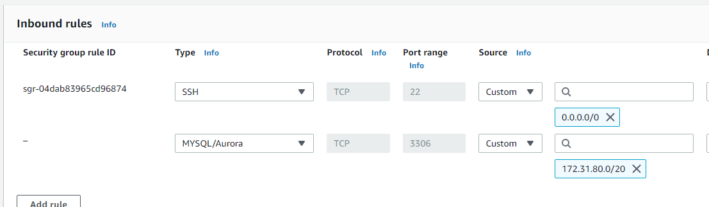
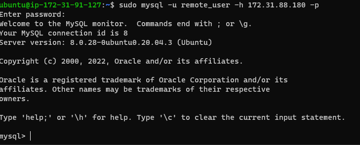
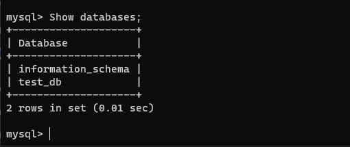

## **CLIENT-SERVER ARCHITECTURE WITH MYSQL DATABASE**

> Create and configure two Linux-based virtual servers: 'mysql server' and 'mysql server'
> On mysql server install MySQL Server software
```Bash
sudo apt update
sudo apt install mysql-server
sudo systemctl enable mysql
sudo apt install mysql-client
```
> Configure the security group of your mysql-server to allow traffic from the mysql-client



> Lock into the mysql-server as root then create a database, a user and grant the user full privileges.
```mysql
sudo mysql
CREATE USER 'remote_user'@'%' IDENTIFIED WITH mysql_native_password BY 'password';
CREATE DATABASE test_db;
GRANT ALL ON test_db.* TO 'remote-user'@'%' WITH GRANT OPTION
FLUSH PRIVILEGES 
```
Configure MYSQL server to allow connections from remote host

`sudo vi /etc/mysql/mysql.conf.d/mysqld.cnf`

> From mysql client Server connect remotely to mysql server Database Engine without using SSH. Use the mysql utility to perform this action

`sudo mysql -u remote_user -h 172.31.88.180 -p`



> Check that you have successfully connected to a remote MySQL server and can perform SQL queries by performing the following querry.
`Show databases;`



